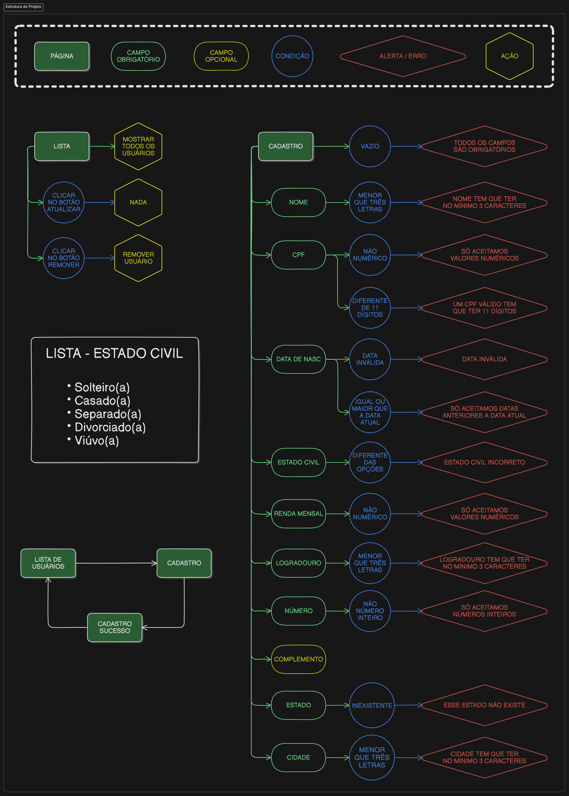

# PWEB Atividade 12 - Cadastro de Usuários [CRUD]

Projeto de PWEB para o treinamento de node.js com express.

## Colaboradores

| Cargo         | Nome                                               | Função                                       |
| ------------- | -------------------------------------------------- | -------------------------------------------- |
| Orientador    | [Leo Fernandes](https://github.com/leofernandesmo) | Avaliar a atividade                          |
| Coordenador   | [Ian dos Santos](https://github.com/IanSantosOS)   | Coordenar a equipe / Utilização do Bootstrap |
| Desenvolvedor | [Joelma Gomes](https://github.com/joelmagomez)     | Backend / rotas                              |
| Desenvolvedor | [Emanuel Felix](https://github.com/lil-robot)      | Backend / validações                         |

## Estrutura do Projeto

## Dependências

| Site das Dependências e Frameworks                       | Motivo da utilização               |
| -------------------------------------------------------- | ---------------------------------- |
| [Bootstrap](https://getbootstrap.com/)                   | Framework de Estilização           |
| [EJS](https://ejs.co/)                                   | HTML dinâmico usando JS            |
| [Express](https://expressjs.com/pt-br/)                  | Framework para desenvolvimento web |
| [Validator](https://github.com/validatorjs/validator.js) | Fazer validação de E-mail          |

    npm i validator ejs express validator
